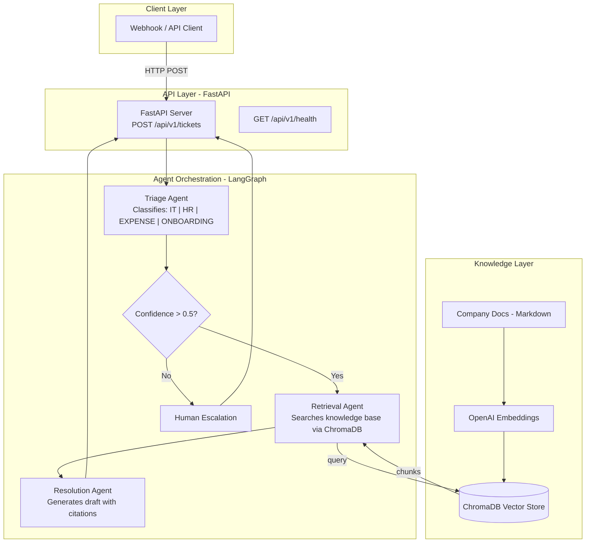

# 🤖 Multi-Agent Enterprise Intelligence & Triage System

A production-ready, multi-agent AI system that autonomously triages incoming corporate support requests, routes them to specialized agents, and generates data-backed resolution drafts using internal knowledge bases.

## Architecture



## How It Works

| Step | Agent | What It Does |
|------|-------|-------------|
| 1 | **Triage Agent** | Classifies ticket intent (IT, HR, Expense, Onboarding, General) |
| 2 | **Retrieval Agent** | Searches ChromaDB for relevant company policy documents |
| 3 | **Resolution Agent** | Generates a professional response draft with inline citations |

If the Triage Agent's confidence is below 50%, the ticket is automatically escalated to a human instead.

## Tech Stack

- **Orchestration**: [LangGraph](https://github.com/langchain-ai/langgraph) (state machine for multi-agent coordination)
- **LLM**: OpenAI GPT-3.5/4 (via LangChain)
- **Vector DB**: [ChromaDB](https://www.trychroma.com/) (local, persistent)
- **API**: [FastAPI](https://fastapi.tiangolo.com/) with Pydantic validation
- **Deployment**: Docker → AWS ECR → AWS ECS Fargate
- **CI/CD**: GitHub Actions

## Quick Start

### Prerequisites
- Python 3.12+
- OpenAI API key

### Setup

```bash
# Clone
git clone https://github.com/vatsalyd/Multi-Agent-System-Planning.git
cd Multi-Agent-System-Planning

# Create virtual environment
python -m venv .venv
.venv\Scripts\activate  # Windows
# source .venv/bin/activate  # macOS/Linux

# Install dependencies
pip install -r requirements.txt

# Configure environment
copy .env.example .env
# Edit .env and add your OPENAI_API_KEY
```

### Populate Knowledge Base

```bash
python -m app.rag.ingest
```

### Run the Server

```bash
uvicorn app.main:app --reload --port 8000
```

### Try It

Open http://localhost:8000/api/v1/docs for the interactive Swagger UI.

**Submit a ticket:**
```bash
curl -X POST http://localhost:8000/api/v1/tickets \
  -H "Content-Type: application/json" \
  -d '{"ticket_text": "I forgot my VPN password and cannot connect remotely."}'
```

## API Reference

| Method | Endpoint | Description |
|--------|----------|-------------|
| `POST` | `/api/v1/tickets` | Full pipeline: triage → retrieve → resolve |
| `POST` | `/api/v1/tickets/triage` | Classification only (no resolution) |
| `GET` | `/api/v1/health` | Health check |
| `GET` | `/api/v1/docs` | Swagger UI |

## Running Tests

```bash
pytest tests/ -v
```

All tests mock external APIs — no API key needed.

## Docker

```bash
# Build and run
docker-compose up --build

# Or standalone
docker build -t multi-agent-triage .
docker run -p 8000:8000 --env-file .env multi-agent-triage
```

## CI/CD (GitHub Actions → AWS ECS)

The pipeline (`.github/workflows/deploy.yml`) runs on every push to `main`:

1. **Test**: `pytest` with mocked APIs
2. **Build**: Docker image → push to AWS ECR
3. **Deploy**: Update ECS Fargate service

### Required GitHub Secrets

| Secret | Description |
|--------|-------------|
| `AWS_ACCESS_KEY_ID` | IAM credentials |
| `AWS_SECRET_ACCESS_KEY` | IAM credentials |
| `AWS_REGION` | e.g., `us-east-1` |
| `ECR_REPOSITORY` | ECR repo name |
| `ECS_CLUSTER` | ECS cluster name |
| `ECS_SERVICE` | ECS service name |

## Project Structure

```
├── app/
│   ├── main.py              # FastAPI entry point
│   ├── config.py            # Settings (pydantic-settings)
│   ├── models.py            # Request/response schemas
│   ├── agents/
│   │   ├── triage.py        # Intent classification
│   │   ├── retrieval.py     # RAG document retrieval
│   │   ├── resolution.py    # Response draft generation
│   │   └── graph.py         # LangGraph state machine
│   ├── rag/
│   │   ├── embeddings.py    # OpenAI embedding wrapper
│   │   ├── vectorstore.py   # ChromaDB client
│   │   └── ingest.py        # Knowledge base ingestion
│   └── data/knowledge_base/ # Company policy docs
├── tests/                   # Unit & integration tests
├── Dockerfile               # Multi-stage build
├── docker-compose.yml       # Local dev
└── .github/workflows/       # CI/CD
```

## License

MIT
