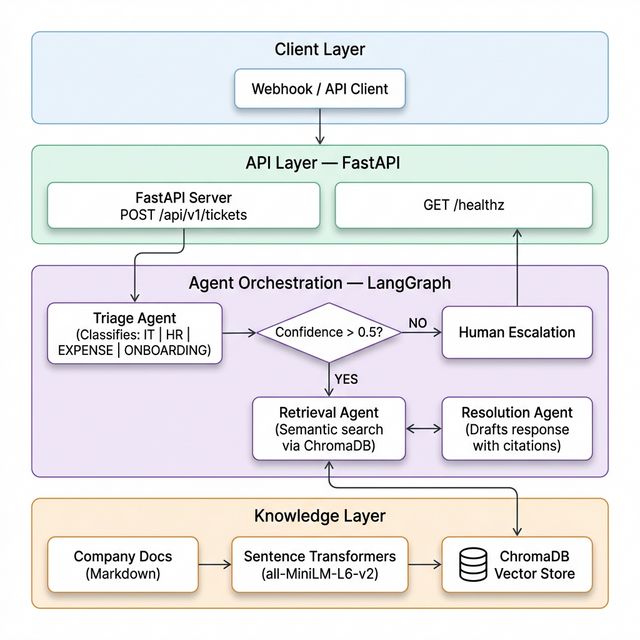

# 🚀 HelixDesk — AI-Powered Enterprise Support Intelligence

<div align="center">

**Autonomous multi-agent system that triages, researches, and resolves enterprise support tickets in seconds — not hours.**

[](https://github.com/vatsalyd/Multi-Agent-System-Planning/actions)


</div>

---

## 🚀 What is HelixDesk?

HelixDesk is a **production-ready, multi-agent AI system** built for enterprise support teams. It processes incoming support tickets through an intelligent pipeline of specialized AI agents that classify, research, and draft professional resolutions — all backed by your company's internal knowledge base.

Instead of a single LLM prompt, HelixDesk uses a **state-machine orchestrated agent graph** where each agent is an expert at one task, producing faster, more accurate, and citation-backed responses.

### ✨ Key Capabilities

- 🏷️ **Smart Triage** — Instantly classifies tickets into categories (IT, HR, Expense, Onboarding) with confidence scoring
- 🔍 **Contextual Retrieval** — Searches your internal knowledge base using semantic vector search to find the most relevant policy documents
- 📝 **Citation-Backed Resolutions** — Generates professional response drafts with inline references to source documents
- ⚡ **Human Escalation** — Automatically routes low-confidence tickets to human agents instead of guessing
- 🔗 **API-First Design** — RESTful API with Swagger UI, ready to integrate with Slack, email parsers, ticketing systems, and webhooks

---

## 🏗️ Architecture

<div align="center">



</div>

### Agent Pipeline

| Step | Agent | What It Does |
|------|-------|-------------|
| 1 | **Triage Agent** | Classifies ticket intent and assigns a confidence score |
| 2 | **Retrieval Agent** | Performs semantic vector search against the knowledge base |
| 3 | **Resolution Agent** | Generates a professional response with inline citations |

If the Triage Agent's confidence falls below **50%**, the ticket is automatically **escalated to a human** instead of producing a low-quality response.

---

## ⚙️ Tech Stack

| Component | Technology | Details |
|-----------|-----------|---------|
| **LLM** | [Groq](https://groq.com/) | `llama-3.3-70b-versatile` — free, fast inference via Groq Cloud |
| **Embeddings** | [Pinecone Inference API](https://www.pinecone.io/) | `multilingual-e5-large` — server-side embeddings, no local model |
| **Vector Database** | [Pinecone](https://www.pinecone.io/) | Serverless vector DB (free tier: 2GB, 1M reads/mo) |
| **Orchestration** | [LangGraph](https://github.com/langchain-ai/langgraph) | State machine for multi-agent coordination and routing |
| **API Framework** | [FastAPI](https://fastapi.tiangolo.com/) | Async REST API with Pydantic validation and auto-generated docs |
| **Deployment** | Docker → Render | Containerized deployments with CI via GitHub Actions |

---

## 💼 Use Cases

| Use Case | Description |
|----------|-------------|
| **IT Helpdesk Automation** | Automatically resolve password resets, VPN issues, software installation requests, and access provisioning tickets |
| **HR Query Resolution** | Instantly answer questions about leave policies, onboarding procedures, benefits, and company handbook references |
| **Expense Report Triage** | Classify and process expense-related queries by referencing reimbursement policies and approval workflows |
| **Employee Onboarding** | Guide new hires through setup procedures, tool access, and first-week checklists with accurate documentation links |
| **Knowledge Base Q&A** | Turn static company documentation into an interactive, searchable support assistant |
| **Ticket Routing & Prioritization** | Pre-classify and route tickets to the correct department before a human ever sees them |

---

## 🚀 Getting Started

### Option 1 — Run Locally

#### Prerequisites
- Python 3.12+
- A free [Groq API key](https://console.groq.com/)
- A free [Pinecone API key](https://app.pinecone.io/)

#### Setup

```bash
# Clone the repository
git clone https://github.com/vatsalyd/Multi-Agent-System-Planning.git
cd Multi-Agent-System-Planning

# Create and activate virtual environment
python -m venv .venv
.venv\Scripts\activate          # Windows
# source .venv/bin/activate     # macOS / Linux

# Install dependencies
pip install -r requirements.txt

# Configure environment
cp .env.example .env
```

Edit `.env` and add your API keys:

```env
GROQ_API_KEY=gsk_your_key_here
PINECONE_API_KEY=pcsk_your_key_here
```

### Environment Variables

| Variable | Required | Default | Description |
|----------|----------|---------|-------------|
| `GROQ_API_KEY` | Yes | — | Groq API key for LLM inference |
| `GROQ_MODEL` | No | `llama-3.3-70b-versatile` | Groq model name |
| `GROQ_REQUEST_TIMEOUT` | No | `30` | LLM request timeout (seconds) |
| `GROQ_MAX_RETRIES` | No | `2` | Max retries for transient LLM failures |
| `PINECONE_API_KEY` | Yes | — | Pinecone API key for vector database |
| `PINECONE_INDEX_NAME` | No | `helixdesk` | Pinecone index name |
| `PINECONE_CLOUD` | No | `aws` | Pinecone cloud provider |
| `PINECONE_REGION` | No | `us-east-1` | Pinecone region (must match index) |
| `PINECONE_EMBEDDING_MODEL` | No | `multilingual-e5-large` | Pinecone embedding model |
| `CHUNK_SIZE` | No | `500` | Document chunk size for ingestion |
| `CHUNK_OVERLAP` | No | `50` | Chunk overlap for ingestion |
| `HOST` | No | `0.0.0.0` | Server host |
| `PORT` | No | `8000` | Server port |
| `LOG_LEVEL` | No | `INFO` | Logging level |

---

### Observability

HelixDesk includes production-ready observability features:

- **Structured JSON Logging** — All API requests and agent operations emit structured JSON logs via `app/logging_config.py`, making logs queryable in ELK, Datadog, CloudWatch, etc.
- **Correlation IDs** — Every request accepts or generates an `X-Correlation-ID` header that propagates through the entire agent pipeline (Triage → Retrieval → Resolution) and appears in all log entries for that request.
- **Health Checks** — `/api/v1/health` verifies Groq API key configuration and Pinecone connectivity; `/healthz` provides a lightweight liveness probe.
- **Configurable Timeouts & Retries** — LLM request timeout and max retries are configurable via `GROQ_REQUEST_TIMEOUT` and `GROQ_MAX_RETRIES`.

---

#### Populate Knowledge Base

```bash
python -m app.rag.ingest
```

#### Start the Server

```bash
uvicorn app.main:app --reload --port 8000
```

Open **http://localhost:8000/api/v1/docs** for the interactive Swagger UI.

---

### Option 2 — Run with Docker

```bash
# Using Docker Compose (recommended)
docker-compose up --build

# Or standalone
docker build -t helixdesk .
docker run -p 8000:8000 --env-file .env helixdesk
```

---

### Option 3 — Deployed Service (Render)

HelixDesk is deployed on Render and accessible at:

```
https://helixdesk.onrender.com/api/v1/docs    # Swagger UI
https://helixdesk.onrender.com/healthz         # Health Check
```

**Deploy to Render (no credit card required):**

1. Create a [Render account](https://dashboard.render.com/register)
2. New → Web Service → Connect your GitHub repo
3. Render auto-detects `render.yaml` and configures:
   - **Runtime:** Python
   - **Build:** `pip install -r requirements.txt`
   - **Start:** `python -m app.rag.ingest && uvicorn app.main:app --host 0.0.0.0 --port $PORT`
   - **Plan:** Free (512MB RAM, 750 hrs/mo, sleeps after 15min idle → 30-50s cold start)
4. In Settings → Environment, add:
   - `GROQ_API_KEY`
   - `PINECONE_API_KEY`
5. Service auto-deploys on every push to `main`!

---

## 📡 API Reference

| Method | Endpoint | Description |
|--------|----------|-------------|
| `POST` | `/api/v1/tickets` | Full pipeline: triage → retrieve → resolve |
| `POST` | `/api/v1/tickets/triage` | Classification only (no resolution) |
| `GET` | `/api/v1/health` | Detailed health check with version info |
| `GET` | `/healthz` | Lightweight liveness probe |
| `GET` | `/api/v1/docs` | Interactive Swagger UI |
| `GET` | `/api/v1/redoc` | ReDoc documentation |

### Example Request

```bash
curl -X POST http://localhost:8000/api/v1/tickets \
  -H "Content-Type: application/json" \
  -d '{"ticket_text": "I forgot my VPN password and cannot connect remotely.", "source": "slack"}'
```

### Example Response

```json
{
  "ticket_id": "a1b2c3d4-...",
  "category": "IT",
  "confidence": 0.92,
  "summary": "Employee unable to access VPN due to forgotten password.",
  "resolution": "To reset your VPN password, follow these steps: ...",
  "sources": ["vpn_setup_guide.md", "it_security_policy.md"],
  "status": "resolved",
  "processing_time_ms": 1840
}
```

---

## 🧪 Running Tests

```bash
pytest tests/ -v
```

All tests use mocked LLM calls — **no API key or network required**.

---

## 🔄 CI/CD Pipeline

The GitHub Actions pipeline (`.github/workflows/deploy.yml`) runs on every push to `main`:

```
Push to main → Run Tests → Build Docker image (verify) → Render auto-deploys
```

**Note:** Deployment to Render happens automatically when you push to the Render-connected repo. The GitHub Actions workflow only runs tests and verifies the Docker build.

### Required GitHub Secrets

None required for CI (tests use mocked LLMs).

### Render Environment Variables (set in Render Dashboard → Settings → Environment)

| Secret | Description |
|--------|-------------|
| `GROQ_API_KEY` | Groq API key for LLM inference |
| `PINECONE_API_KEY` | Pinecone API key for vector database |

---

## 📁 Project Structure

```
├── app/
│   ├── main.py              # FastAPI entry point & route handlers
│   ├── config.py            # Centralized settings (pydantic-settings)
│   ├── models.py            # Request/response Pydantic schemas
│   ├── logging_config.py    # Structured JSON logging + correlation IDs
│   ├── agents/
│   │   ├── triage.py        # Intent classification agent
│   │   ├── retrieval.py     # RAG document retrieval agent
│   │   ├── resolution.py    # Response generation agent
│   │   └── graph.py         # LangGraph state machine orchestrator
│   ├── llm/
│   │   └── provider.py      # LLM factory (single source of truth)
│   ├── rag/
│   │   ├── embeddings.py    # Pinecone Inference API embedding wrapper
│   │   ├── vectorstore.py   # Pinecone client & query interface
│   │   └── ingest.py        # Knowledge base ingestion script
│   └── data/knowledge_base/ # Company policy documents (Markdown)
├── tests/                   # Unit & integration tests (mocked)
├── Dockerfile               # Multi-stage production build (port 8000)
├── docker-compose.yml       # Local development setup
├── render.yaml              # Render blueprint spec
├── .github/workflows/       # CI pipeline (tests + Docker build verify)
├── .env.example             # Environment variable template
└── SPECS/deploy.md          # Deployment specification
```

---

## 📄 License

MIT — see [LICENSE](LICENSE) for details.